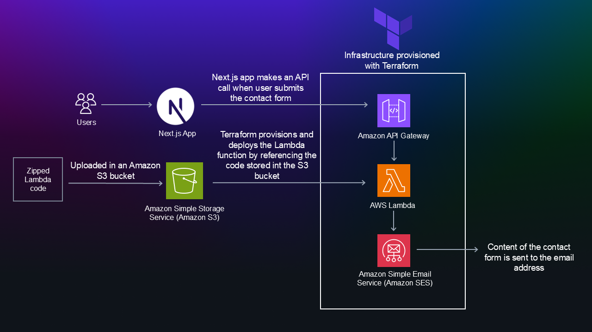

# Serverless Contact Form Infrastructure

This repository contains Terraform code and GitHub Actions workflows to provision and manage a serverless contact form backend on AWS. It uses API Gateway, Lambda, and SES for sending emails.

---

## Table of Contents

* [Architecture](#architecture)
* [Directory Structure](#directory-structure)
* [Prerequisites](#prerequisites)
* [Getting Started](#getting-started)

  * [Configure AWS Credentials](#configure-aws-credentials)
  * [Initialize Terraform](#initialize-terraform)
  * [Plan and Apply](#plan-and-apply)
* [Backend Configuration](#backend-configuration)
* [Outputs](#outputs)
* [Module Reference](#module-reference)
* [CI/CD Workflows](#cicd-workflows)
* [Cleanup](#cleanup)
* [Customizations](#customizations)

---

## Architecture



* **AWS API Gateway**: Exposes a POST endpoint for the contact form.
* **AWS Lambda**: Processes form submissions and sends email via SES.
* **AWS SES**: Simple Email Service for delivering form data as emails.

---

## Directory Structure

```
├── .github
│   └── workflows
│       ├── cleanup.yml      # GH Action to destroy infrastructure
│       └── deploy.yml       # GH Action to plan & apply changes
├── modules
│   └── serverless-backend-aws
│       ├── resource-api-gateway.tf
│       ├── resource-lambda.tf
│       ├── outputs.tf       # Exposed module outputs
├── backend.tf               # Root-level backend configuration (AWS S3 for Stores state remotely)
├── main.tf                  # Root module: loads `serverless-backend-aws` and CORS module
├── outputs.tf               # Root-level outputs (API URL)
├── provider.tf              # Root-level AWS provider settings
└── README.md                # This file
```

---

## Prerequisites

1. **AWS Account** with permissions to create API Gateway, Lambda, IAM, S3 (state), and SES.
2. **Terraform** (v1.4.0 or higher recommended).
3. **AWS CLI** configured locally (for manual testing).
4. **GitHub Secrets** (if using CI/CD):

   * `AWS_ACCESS_KEY_ID`
   * `AWS_SECRET_ACCESS_KEY`
   * `AWS_REGION`

---

## Getting Started

### Configure AWS Credentials

Locally, export your credentials:

```bash
export AWS_ACCESS_KEY_ID=your-access-key
export AWS_SECRET_ACCESS_KEY=your-secret-key
export AWS_REGION=eu-north-1     # or your preferred region
```

### Initialize Terraform

```bash
terraform init
```

### Plan and Apply

```bash
terraform plan -out=tfplan
terraform apply tfplan
```

After apply, note the output `api_gateway_url` to hit the contact form endpoint.

---

## Backend Configuration

The root `backend.tf` configures a remote state backend (S3 or Terraform Cloud). Example S3:

```hcl
terraform {
  backend "s3" {
    bucket = "S3-bucket-name"
    key    = "nextjs-contact-form/terraform.tfstate"
    region = "eu-north-1"
    encrypt = true
  }
}
```

---

## Outputs

* `api_gateway_contact_form_id`: The API Gateway Rest API ID.
* `api_gateway_url`: The full invoke URL (e.g. `https://xxxx.execute-api.eu-north-1.amazonaws.com/dev`).

---

## Module Reference

The `modules/serverless-backend-aws` module encapsulates:

* `aws_api_gateway_rest_api`
* `aws_api_gateway_method` & `aws_api_gateway_integration`
* `aws_lambda_function` + S3 deployment
* `aws_iam_role` for Lambda execution
* `aws_lambda_permission`

Use module inputs/outputs to override names or ARNs.

---

## CI/CD Workflows

* **deploy.yml**: Runs `terraform init`, `plan`, and `apply` on pushes to `main`.
* **cleanup.yml**: Manually or scheduled workflow that plans and destroys the stack.
  
---

## Cleanup

To tear down all resources (locally):

```bash
terraform plan -destroy -out=tfplan-destroy
terraform apply tfplan-destroy
```

Or trigger the `Terraform Cleanup` GitHub Action in the Actions tab.

---

## Customizations

* **CORS Origin**: Adjust `allow_origin` in `main.tf` for your frontend domain.
* **SES Policy**: Modify IAM `inline_policy` to scope SES actions to your verified identities.
* **Lambda Code**: Update the S3 bucket/key or switch to local `filename` deployment.

---

## Contributing
Feel free to submit issues, fork the repository, and send pull requests. Contributions are welcome!

## Author
- **Pasindu Waidyarathna**
